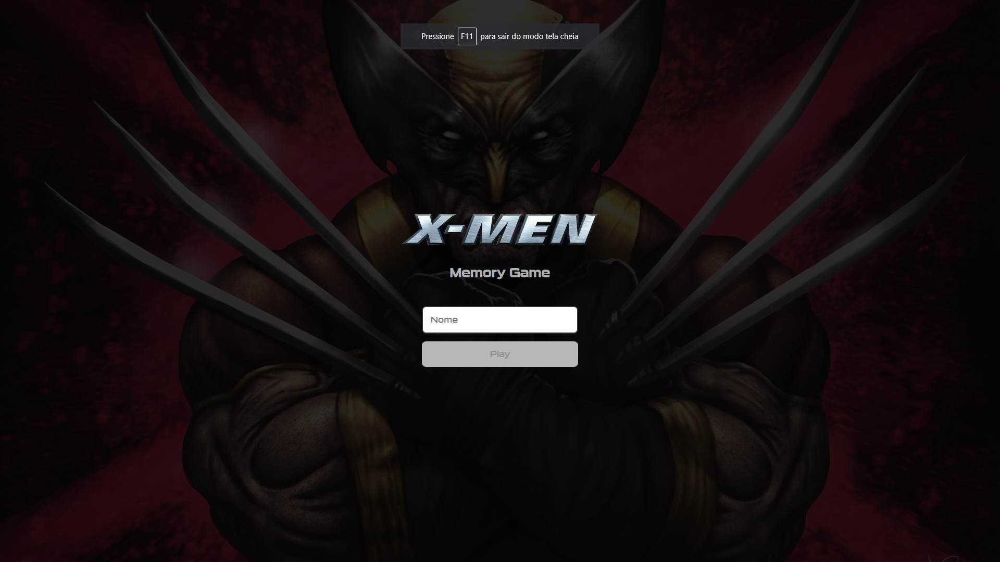
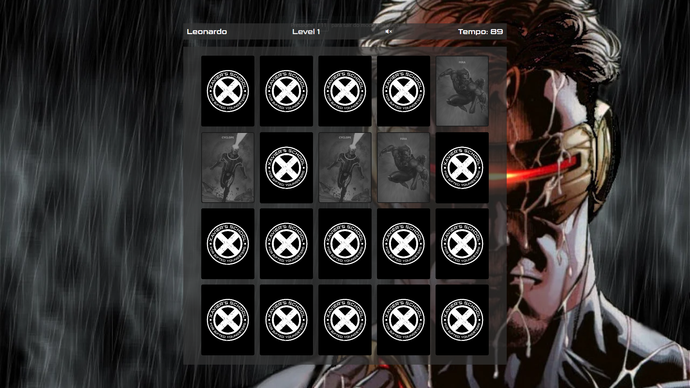

# Memory Game X-men theme

## 1. About the project

<p>This game was developed with the intention of putting into practice the concepts of programming logic and applying what was learned in JavaScript. It is a memory game that challenges players to find matching pairs of cards.</p>
<p>By developing this game, I was able to improve my problem-solving skills and apply the concepts learned in JavaScript. I used DOM manipulation techniques, such as event handling and style modifications.</p>
<p>The game features 3 levels of difficulty, different music for each level, and user name registration in local storage.</p>

## 2. Clone the project
Open your terminal, choose the folder of your preference, and paste the following command to clone this repository:
````
git clone https://github.com/ferreira-leonardo/projeto-jogo-da-memoria.git
````

Enter the repository folder using the following command:
````
cd projeto-jogo-da-memoria
````

Open the project in VS Code using the following command:
````
code .
````

## 3. Media


